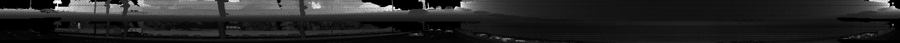
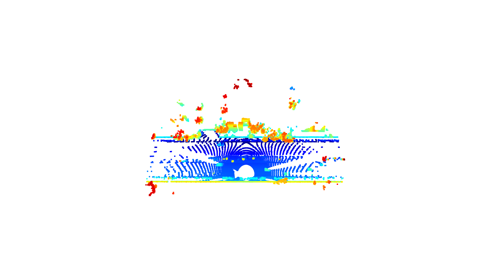
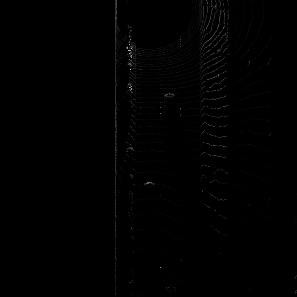
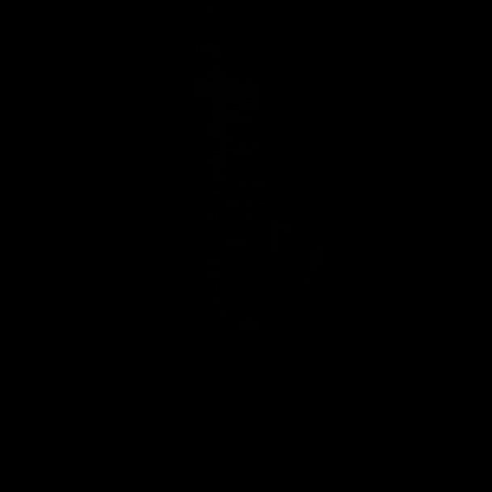

#3D Object Detect 

##Compute Lidar Point-Cloud from Range Image

### Visualize range image channels (ID_S1_EX1)
The first step for in 3D object detection is create a range image from LiDAR sensor. For this project vehicle's top LiDAR was used to create the image. After extracting the data from frame object and maping the 8-bit range image and intensity image we get this result 

### Visualize point-cloud (ID_S1_EX2)

To visualize the point cloud 10 images where generated to analysis, they were trnasform to be shown as BEV images. 

In this serie we can see 3 cars, two in front of the LiDAR and one on the back. After getting the pcl images the intensity layer of the BEV map where compute and generate new images:

 
 
And tune the intensity to improve image visualization
 

##Create Birds-Eye View from Lidar PCL

###Convert sensor coordinates to bev-map coordinates (ID_S2_EX1)

###Compute intensity layer of bev-map (ID_S2_EX2)

###Compute height layer of bev-map (ID_S2_EX3)

##Model-based Object Detection in BEV Image

###Add a second model from a GitHub repo (ID_S3_EX1)

###Extract 3D bounding boxes from model response (ID_S3_EX2)

##Performance Evaluation for Object Detection

###Compute intersection-over-union (IOU) between labels and detections (ID_S4_EX1)

###Compute false-negatives and false-positives (ID_S4_EX2)

###Compute precision and recall (ID_S4_EX3)
