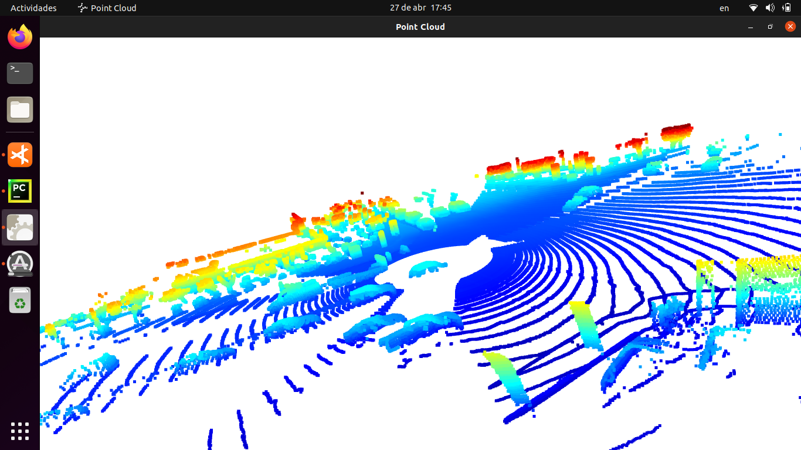
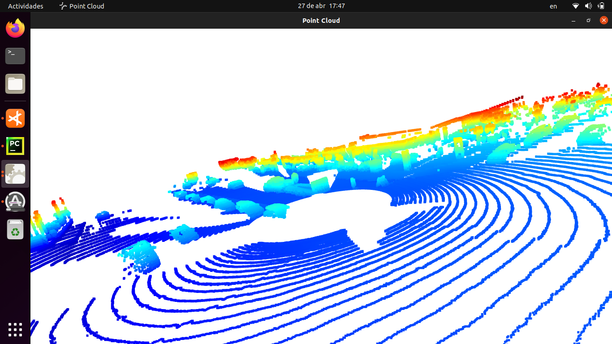

#3D Object Detect 

##Step 1 Compute Lidar Point-Cloud from Range Image

### Visualize range image channels (ID_S1_EX1)
The first step in 3D object detection is to create a range image from the LiDAR sensor. For this project vehicle's top LiDAR was used to create the image. After extracting the data from the frame object and mapping the 8-bit range image and intensity image we get this result 

### Visualize point-cloud (ID_S1_EX2)

After getting the range image we visualize the point clouds from the lidar sensor, to accomplish that Open3D library was used to create a window and load the point cloud, also a callback was set to the window to update it to show the next point cloud.
Next are some examples: 

We can identify some features of the detected cars. Depending on if the detected cars are in front, left, right, or back of our vehicle the visible feature will change, here are some of the more stable features:
- Hood
- Front Windshield
- Front bodywork half
- Trunk
- Back windshield
- Back bodywork half
- Bumpers
- Rearview mirrors

##Create Birds-Eye View from Lidar PCL

###Convert sensor coordinates to Bev-map coordinates (ID_S2_EX1)
After getting the point cloud from the LiDAR sensor we can create a BEV map, in order to do that we need to convert the points from sensors coordinates into BEV coordinates following these steps:
- Discretize the BEV map
- Make a copy of the Point Cloud and convert its X coordinates into BEV coordinates
- Transform Point Cloud's Y coordinates to BEV coordinates and center the X-axis on the image's center
- Change the floor's plane on Z-axis
- Reorder the Point Cloud's X-axis, then Y-axis, and finally the heights in decreasing order
- Extract the duplicated X and Y points so we get the points with the higher Z value
- Create a map and assign all the ordered values to it. Normalize each position so the points get between the higher and lower height threshold
- Reorder points in the Point Cloud so they are ordered by their intensity value
- Remove duplicate points

After doing this process we can get the intensity map

###Compute intensity layer of bev-map (ID_S2_EX2)
After getting transforming the point cloud coordinates we can create the intensity layer of the BEV map where compute to generate new images:

 
 

###Compute height layer of bev-map (ID_S2_EX3)
To improve the intensity image we have to limit the intensity so we can get an image like this:

 

##Model-based Object Detection in BEV Image

###Extract 3D bounding boxes from model response (ID_S3_EX2)
After generating the intensity map we can use it to detect vehicles around the LiDAR.
Here is an example of object detection with the intensity map and showing the same vehicles in an image from the camera

##Performance Evaluation for Object Detection

###Compute intersection-over-union (IOU) between labels and detections (ID_S4_EX1)
 To evaluate the performance of our object detection software we are going to calculate the precision and the recall, to do it first we need to calculate the Intersection Over Union ***(IOU)*** to calculate the confusion matrix term. With IOU we are aiming to match the prediction bounding box and the ground truth, if the areas of those boxes are located nearly in the same position we can trust the observation to be a true positive, if there is a ground truth and the boxes' position doesn't match we have a false negative and in the case the is a prediction bounding box, but there is not a ground true we have a false positive.

###Compute false-negatives and false-positives (ID_S4_EX2)
After obtaining all the IOU we calculate the number of true positives, false negatives, and false positives.

###Compute precision and recall (ID_S4_EX3)
Here are the results for presicion and recall using the secuence ***'training_segment-1005081002024129653_5313_150_5333_150_with_camera_labels.tfrecord'*** from frame 50 to 150:
-***Presicion:*** 0.39022439024390244
-***Recall:*** 0.06857142857142857

Next are the result's graphics:

