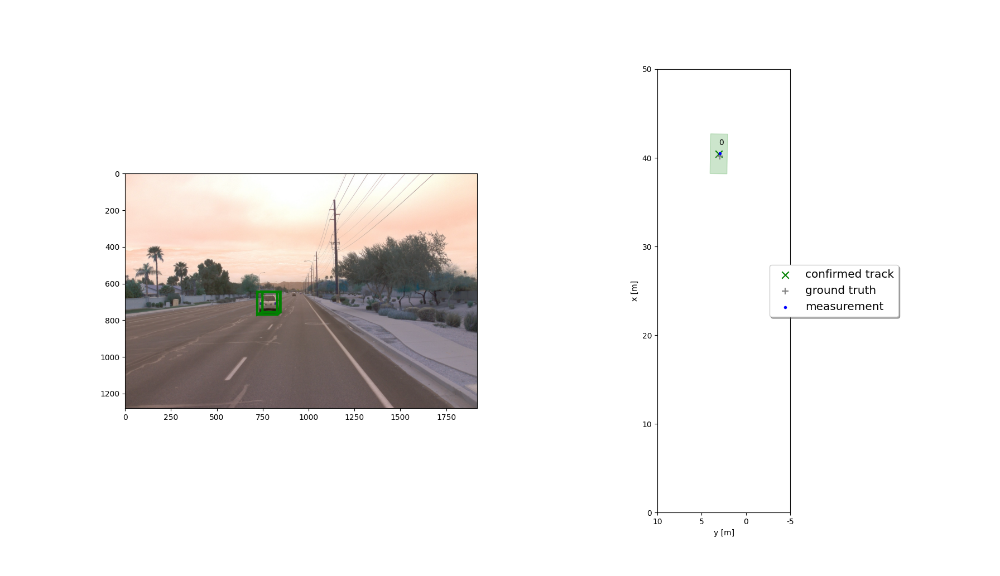
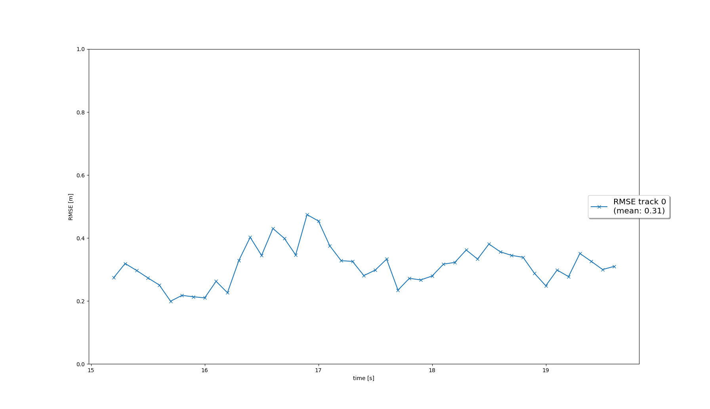
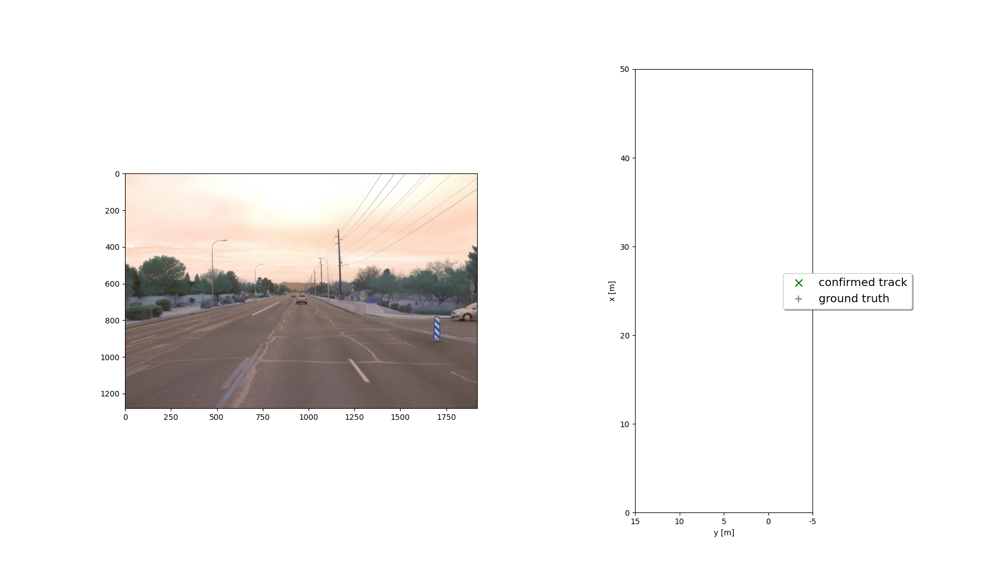
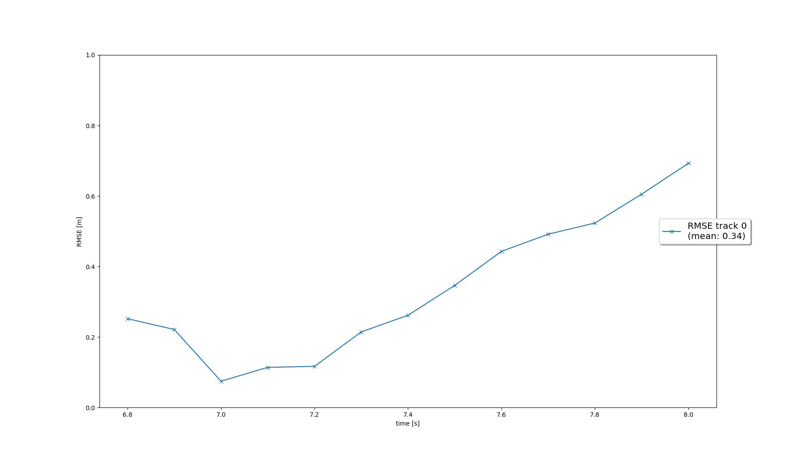
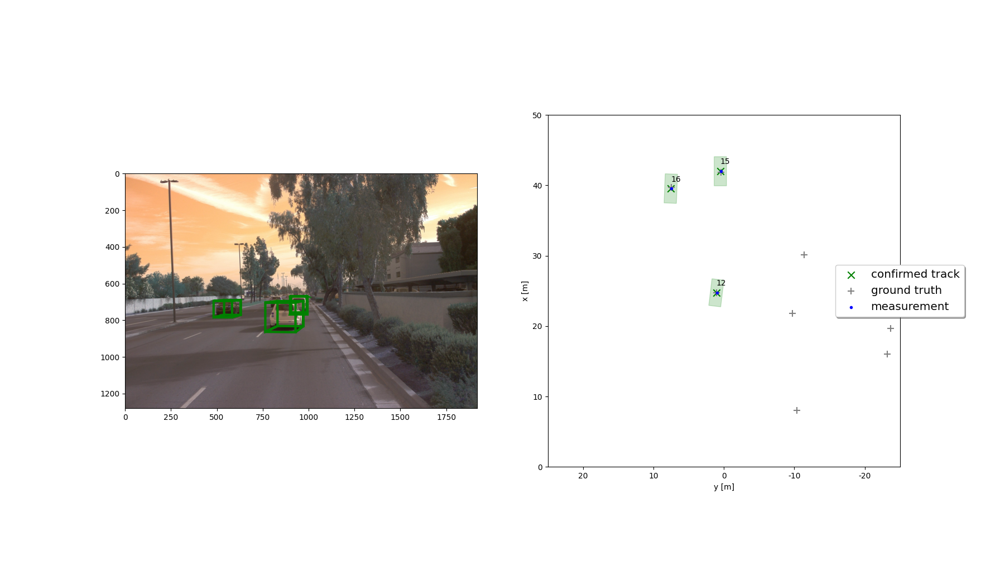
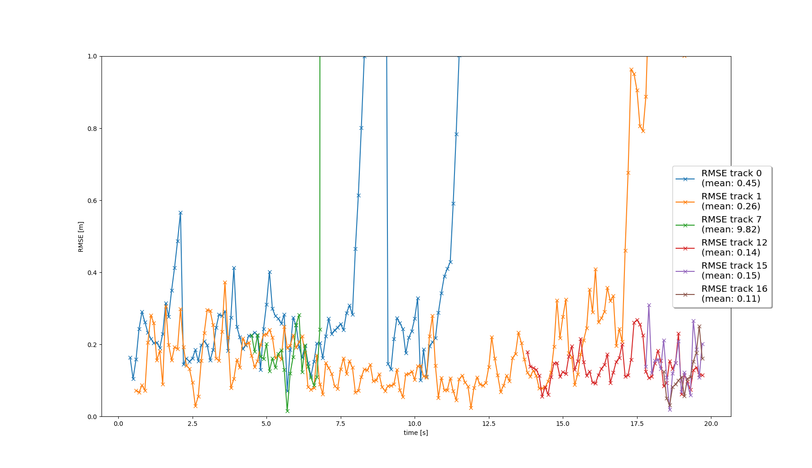

#Sensor Fusion Final Project

##Project Steps

- ###Step 1 - Tracking

In this step, we implemented an ***Extended Kalman Filter*** (EKF). In order to do that some functions were developed inside
the file *student/filter.py*:

- predict(): This function is the EKF's prediction step, in here the equations ***X'=F.X+U*** and ***P'=F.P.Q*** were implemented
````
    track.set_x(self.F() * track.x)
    track.set_P(self.F() * track.P * self.F().T + self.Q())
````
- F(): this function returns the State Transition Matrix
````
    return np.matrix([[1, 0, 0, params.dt, 0, 0],
                          [0, 1, 0, 0, params.dt, 0],
                          [0, 0, 1, 0, 0, params.dt],
                          [0, 0, 0, 1, 0, 0],
                          [0, 0, 0, 0, 1, 0],
                          [0, 0, 0, 0, 0, 1]])
````
- Q(): this function returns the Noise Covariance Matrix
````
    self.q = params.q
    q1 = ((params.dt ** 3) / 3) * self.q
    q2 = ((params.dt ** 2) / 2) * self.q
    q3 = params.dt * self.q
    return np.matrix([[q1, 0, 0, q2, 0, 0],
                      [0, q1, 0, 0, q2, 0],
                      [0, 0, q1, 0, 0, q2],
                      [q2, 0, 0, q3, 0, 0],
                      [0, q2, 0, 0, q3, 0],
                      [0, 0, q2, 0, 0, q3]])
````
- update(): This function is the EKF's update step. In here the formulas ***γ=z-H.X, S=H.P.H^t+R, K=P.H^t.S^-1, X'=X+K.γ,
P'=(I-K.H)P*** were implemented
````
        H = meas.sensor.get_H(track.x)
        gamma = self.gamma(track, meas)
        S = self.S(track, meas, H)
        K = track.P * H.T * np.linalg.inv(S)
        I = np.identity(params.dim_state)

        track.set_x(track.x + K * gamma)
        track.set_P((I - K * H) * track.P)
````
- gamma(): Returns the error
````
    return meas.z - meas.sensor.get_hx(track.x)
````
- S(): Returns the covariance
````
    return H * track.P * H.T + meas.R
````

Here are the results obtains in this step



- ###Step 2 - Tracking Management
In this step, the track management system was implemented, for that we calculate the Mahalanobis Distance between the observed
object and the prediction, for that the next function were developed:

- def __init__(self, meas, id): this is the Track class init function, in this function we want to initialize the x and P
matrices based on the input measurement
````
        sensor_position = np.ones((4, 1))
        sensor_position[0:3] = meas.z[0:3]
        vehicle_position = meas.sensor.sens_to_veh * sensor_position

        self.x = np.zeros((params.dim_state, 1))
        self.x[0:3] = vehicle_position[0:3]

        p_pos = M_rot * meas.R * M_rot.transpose()
        p_vel = np.matrix([[params.sigma_p44 ** 2, 0, 0],
                           [0, params.sigma_p55 ** 2, 0],
                           [0, 0, params.sigma_p66 ** 2]])

        self.P = np.zeros((6, 6))
        self.P[0:3, 0:3] = p_pos
        self.P[3:6, 3:6] = p_vel

        self.state = 'initialized'
        self.score = 1 / params.window
````
- manage_tracks(): This function manages the score decrease and the track deletion. To decrease a score it should be inside 
the field of view of the sensor, to delete a track one of three conditions must be true: the track's state is confirmed 
and its score is below the delete-threshold, the track's  covariance is bigger than 3^2, or if the track's score is lower 
than 0.05
````
    # decrease score for unassigned tracks
        for i in unassigned_tracks:
            track = self.track_list[i]
            # check visibility    
            if meas_list:  # if not empty
                if meas_list[0].sensor.in_fov(track.x):
                    # your code goes here
                    track.score -= 1. / params.window

        # delete old tracks

        for track in self.track_list:
            if (track.state in ["confirmed"] and track.score < params.delete_threshold) \
                    or (track.P[0, 0] > params.max_P or track.P[1, 1] > params.max_P) \
                    or (track.score < 0.05):
                self.delete_track(track)
````
- handle_updated_track(): This function handles the score increment when a track is updated
````
        track.score += (1.0 / params.window)

        if track.score >= params.confirmed_threshold:
            track.state = 'confirmed'
        else:
            track.state = 'tentative'
````

In this step the next results were obtained



- ##Step 3 - Data Association
In this step, the track association feature was implemented to be able to track multiple cars on every frame. The next
functions were implemented

- associate(): in this function, the association matrix is filled with the track's index that is inside the gate and initializes 
the unassigned tracks with the ones that lay outside the gate
````
        N = len(track_list)
        M = len(meas_list)

        self.association_matrix = np.matrix([])  # reset matrix
        self.unassigned_tracks = []  # reset lists
        self.unassigned_meas = []

        if N > 0:
            self.unassigned_tracks = list(range(N))
        if M > 0:
            self.unassigned_meas = list(range(M)) if M > 0 else []
        if N > 0 and M > 0:
            self.association_matrix = np.asmatrix(np.inf * np.ones((N, M)))

        for i in range(N):
            for j in range(M):
                distance = self.MHD(track_list[i], meas_list[j], KF)
                if self.gating(distance, meas_list[j].sensor):
                    self.association_matrix[i, j] = distance
````
- MHD(): this function returns the Mahalanobis Distance
````
        H = meas.sensor.get_H(track.x)
        gamma = KF.gamma(track, meas)
        S = KF.S(track, meas, H)
        MHD = gamma.T * np.linalg.inv(S) * gamma
        return MHD
````
- gating(): this function returns if the track is inside the gate
````
        return True if MHD < chi2.ppf(params.gating_threshold, sensor.dim_meas) else False
````

- get_closest_track_and_meas(): in this function the Mahalanobis algorithm is implemented, calculating the association matrix and deleting 
the unassigned tracks
````
A = self.association_matrix

        if np.min(A) == np.inf:
            return np.nan, np.nan

        ij_min = np.unravel_index(np.argmin(A, axis=None), A.shape)

        ind_track = ij_min[0]
        ind_meas = ij_min[1]

        A = np.delete(A, ind_track, 0)
        A = np.delete(A, ind_meas, 1)
        self.association_matrix = A
        update_track = self.unassigned_tracks[ind_track]
        update_meas = self.unassigned_meas[ind_meas]

        # remove from list
        self.unassigned_tracks.remove(update_track)
        self.unassigned_meas.remove(update_meas)
````

- ##Step 4 - Sensor Fusion
Now the last step of the project is to implement the sensor fusion, for that the camera sensor was enabled to apply the past
3 steps to the data registered by the front camera.

In this step the functions implemented were:
- in_fov(): this function check is the observation x is inside the sensor field of view
````
        pos_veh = np.ones((4, 1))
        pos_veh[0:3] = x[0:3]
        pos_sensor = self.veh_to_sens * pos_veh
        visible = False

        if pos_sensor[0] > 0:
            alpha = np.arctan(pos_sensor[1]/pos_sensor[0])
            if self.fov[0] < alpha < self.fov[1]:
                visible = True

        return visible
````
- get_hx(): returns camera observation matrix H
````
            pos_veh = np.ones((4, 1))
            pos_veh[0:3] = x[0:3]
            pos_sensor = self.veh_to_sens * pos_veh

            if pos_sensor[0] == 0:
                raise Exception(" ")

            hx = np.zeros((2, 1))

            hx[0] = self.c_i - ((self.f_i * pos_sensor[1]) / pos_sensor[0])
            hx[1] = self.c_j - ((self.f_j * pos_sensor[2]) / pos_sensor[0])

            return hx
````
- generate_measurement(): The only change in this function was to remove the if that restricted the measurement to LiDAR only
````
        meas = Measurement(num_frame, z, self)
        meas_list.append(meas)
        return meas_list
````

- Mesurements' def __init__(): in this function the camera sensor parameters are initialized
````
            self.z = np.zeros((sensor.dim_meas, 1))
            self.z[0] = z[0]
            self.z[1] = z[1]

            self.R = np.matrix([[params.sigma_cam_i ** 2, 0],
                                [0, params.sigma_cam_j ** 2]])
````


Result for step 4:




## Sensor Fusion Advantage

The main advantage sensor fusion offer is that you can complement the information from one sensor with another one,
which gives the possibility to overcome any weakness the sensors chosen can have. For example, the objects not detected by LiDAR sensor due to its surface nature the camera sensor can still detect the object.
In this project the effectiveness of sensor fusion comes to light in step 4, activation measurements from the camera improve
object tracking.

## Sensor Fusion Challenge
One of the challenges a sensor fusion system can face is keeping the data processing from multiple sensors synced, which will
require an important amount of hardware resource or a very careful software architecture design to overcome this.

## Improvement Area

I think one of the most important improvements this project can have is the tracking association algorithm